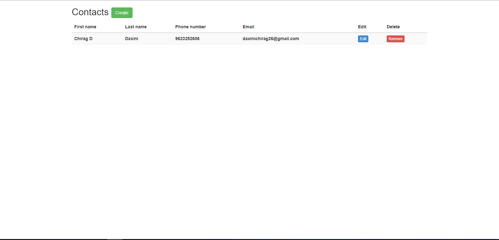
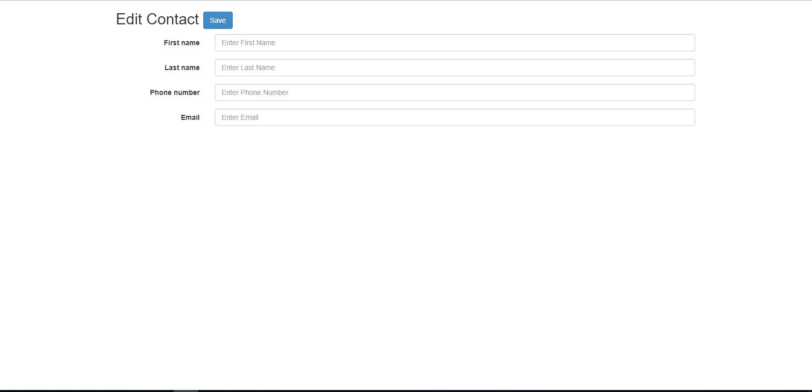

# ContactLibrary
<table>
<tr>
<td>
  ContactLibrary is application use for mainining contacts over the internet.user can do create,update,delete contacts using this application.
</td>
</tr>
</table>

## Site

### Landing Page

### Add/Edit Contact Page

## System requirements

* Windows Os (**Unix-OS isn't supported**);
* Editor (Visual Studio 2013 or higher)
* Framework (.Net Framework 4.5.2 or higher)
* Database (SQL Server 2008 or higher);
* WebServer (Local IIS)
* Nuget Package manager
* Version Control System (GitHub or Tortoise SVN for GitHub)

## Development Configuration

* Clone project from GitHub repository.
* Open Visual Studio solution in vs 2013 or higher
* Download all the dependency using Nuget Package Manager
* Open Web.Config file from ContactLibrary.Web folder
* Update sql server connection string in file.
* Build & Run Application

## Test
* Run MSTest from ContactLibrary.Tests project.

## Maintainer
For feature request or troubleshooting email me @ <daxinichirag26@gmail.com>

